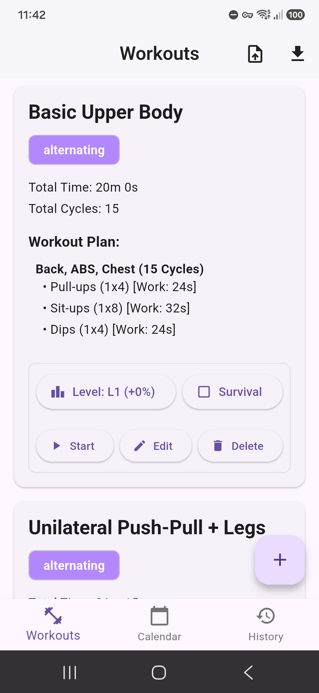
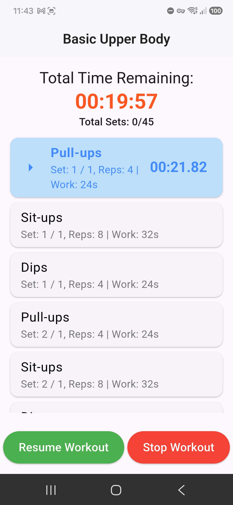

# Workout Timer

A Flutter app for creating, managing, and performing custom workout routines with guided audio timers.

<p align="center">
  
  
</p>

## Download

Pre-built APKs are available on the [Releases page](https://github.com/AmitTzah/workout-timer-app/releases). Download the latest `app-release.apk` and install it on your Android device.

## Features

- **Custom Workouts** — Create workouts with any combination of exercises, sets, reps, work time, and rest periods
- **Two Workout Modes** — Sequential (one exercise at a time) or Alternating (cycle between grouped exercises)
- **Guided Audio Timer** — Voice announcements for exercise changes, rest periods, and workout completion
- **Workout History** — Browse past workouts with detailed summaries including sets performed and duration
- **Calendar View** — Visual calendar showing when you worked out and what you did
- **Level System** — Scale workout intensity with configurable difficulty levels
- **Survival Mode** — Adaptive mode that increases difficulty as you progress through sets
- **Workout Notes** — Add and edit notes on completed workout summaries
- **Data Backup** — Export your workouts and history to JSON, or import from a backup file

## Tech Stack

| Component | Technology |
|-----------|-----------|
| Framework | Flutter |
| Database | SQFlite (SQLite) |
| State Management | Provider |
| Audio | `audioplayers` |
| Calendar | `table_calendar` |
| File I/O | `file_picker` + `path_provider` |
| Serialization | `json_serializable` |

## Getting Started

### Prerequisites

- [Flutter SDK](https://docs.flutter.dev/get-started/install) (^3.8.1)
- Android SDK (for Android builds)

### Build from Source

```bash
git clone https://github.com/AmitTzah/workout-timer-app.git
cd workout-timer-app
flutter pub get
flutter run
```

To build a release APK:

```bash
flutter build apk --release
```

The APK will be at `build/app/outputs/flutter-apk/app-release.apk`.

## License

MIT — see [LICENSE](LICENSE) for details.
